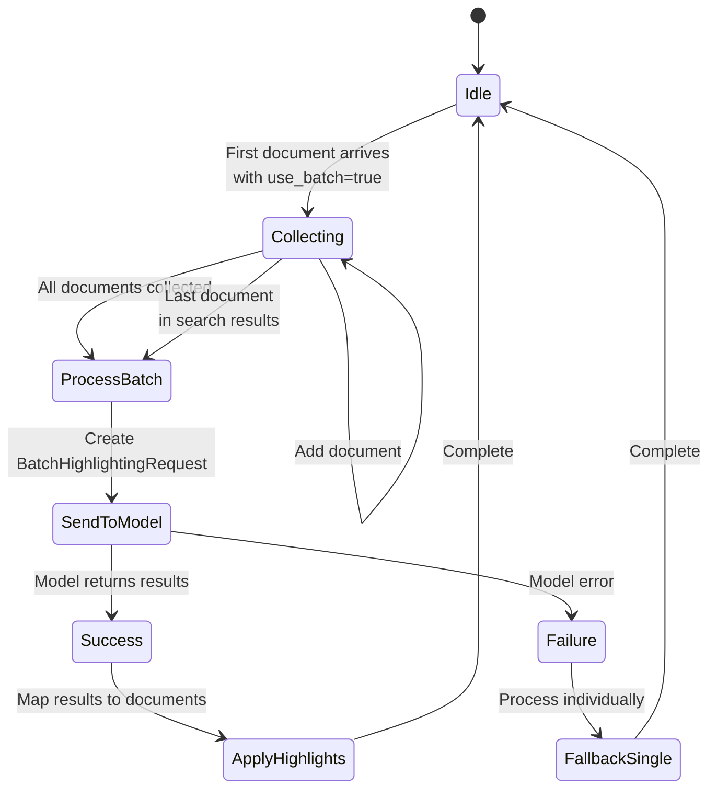

# Batch Semantic Highlighting Design Document

## 1. Overview

This document outlines the design for implementing batch semantic highlighting in OpenSearch, which allows processing multiple documents in a single ML model inference call for improved performance.

### 1.1 Document Structure
- **Section 1-3**: Background and current state
- **Section 4-6**: Proposed architecture and implementation
- **Section 7-9**: API design and error handling
- **Section 10-12**: Testing, migration, and security
- **Section 13-15**: Future work and appendices

## 2. Goals

1. **Performance**: Reduce latency by processing multiple documents in a single model inference call
2. **Compatibility**: Support both batch and single-document processing with backward compatibility
3. **Flexibility**: Support both remote (SageMaker) and local ML models
4. **Clean Architecture**: Remove parallel processing complexity in favor of true batch processing
5. **Scalability**: Support configurable batch sizes (1-128+ documents)

## 3. Current State Analysis

### 3.1 Existing Implementation Issues
- Current implementation uses parallel processing as a fallback when batch fails
- ML Commons sends parameters as JSON strings, but SageMaker expects JSON objects
- Parameter format mismatch: `{"batch": "[{...}]"}` vs `{"parameters": {"batch": [{...}]}}`

### 3.2 Performance Benchmarks  
- Single document processing: ~50-100ms per document
- Batch processing (verified with production models): ~8ms per document
- Actual improvement: 6-12x faster with batch processing

### 3.3 Model Capabilities

#### Batch Model Requirements
| Model Type | Batch Support | Batch Size | Expected Performance |
|------------|---------------|------------|---------------------|
| Single Document | No | 1 | ~50-100ms |
| Batch Processing | Yes | Configurable (model-side) | ~8ms per doc |

#### Technical Specifications
- **Architecture**: BERT-based models (e.g., `bert-base-uncased`)
- **Dynamic Batching**: Supports variable batch sizes without recompilation
- **Batch Size**: Configured at model deployment (e.g., 512)
- **Model Format**: TorchScript for deployment flexibility
- **Reference Implementation**: `/home/junqiu/tracing_gpu/batch_model/FINAL/`

## 4. Proposed Architecture

### 4.1 High-Level Flow


### 4.2 Component Changes

#### 4.2.1 Neural Search Plugin Changes

**SemanticHighlightActionFilter.java**
- Remove parallel processing logic
- Implement clean batch collection
- Handle batch/single mode based on use_batch flag

**MLCommonsClientAccessor.java**
- Remove parallel processing fallback
- Implement proper batch inference method
- Support both local and remote models

**BatchHighlightingRequest.java** (new)
- Clean request structure for batch highlighting
- Support variable batch sizes

#### 4.2.2 ML Commons Plugin Changes

**RemoteConnectorExecutor.java**
- Add support for complex parameter types (not just strings)
- Handle batch parameter formatting correctly

**MLInput/MLInputDataSet**
- Create new BatchHighlightingInputDataSet for batch requests
- Support proper serialization of batch data

**Pre/Post Processing Functions**
- Create batch-specific processing functions
- Handle response parsing for batch results

## 5. Implementation Details

### 5.1 Class Hierarchy (Neural Search 3.0.0+)


### 5.2 Batch Request Format

```java
@SuperBuilder
@NoArgsConstructor
@Getter
@Setter
public class BatchHighlightingRequest extends InferenceRequest {
    private List<HighlightingItem> items;
    
    @Builder
    @AllArgsConstructor
    @NoArgsConstructor
    @Getter
    @Setter
    public static class HighlightingItem {
        private String documentId;  // for result correlation
        private String question;
        private String context;
    }
}
```

### 5.2 ML Commons Batch Input Dataset

```java
public class BatchHighlightingInputDataSet extends MLInputDataset {
    private List<Map<String, String>> batch;
    
    @Override
    public void writeTo(StreamOutput out) throws IOException {
        // Serialize as proper JSON array, not string
    }
}
```

### 5.3 Batch Processing Sequence


### 5.4 Configuration

```json
{
  "highlight": {
    "fields": {
      "content": {
        "type": "semantic"
      }
    },
    "options": {
      "model_id": "<your-batch-model-id>",
      "use_batch": true
    }
  }
}
```

## 6. API Design

### 6.1 Search Request with Batch Highlighting

```json
POST /index/_search
{
  "query": {
    "match": {"content": "symptoms"}
  },
  "highlight": {
    "fields": {
      "content": {
        "type": "semantic",
        "pre_tags": ["<mark>"],
        "post_tags": ["</mark>"]
      }
    },
    "options": {
      "model_id": "highlighting-model-id",
      "use_batch": true
    }
  }
}
```

### 6.2 Response Format (unchanged)

```json
{
  "hits": {
    "hits": [{
      "_source": {...},
      "highlight": {
        "content": [
          "The <mark>symptoms include fever</mark> and cough."
        ]
      }
    }]
  }
}
```

## 7. Batch Collection Strategy



## 8. Error Handling

1. **Batch Size**: Respect model-configured limits (no client-side limit needed)
2. **Model Compatibility**: Gracefully fall back to single processing if model doesn't support batch
3. **Partial Failures**: Return results for successful items, log failures
4. **Timeout Handling**: Process partial batch if timeout is reached

## 9. Testing Strategy

### 9.1 Unit Tests
- Test batch request creation
- Test batch response parsing
- Test error scenarios

### 9.2 Integration Tests
- Test with local models
- Test with remote models (including deployed models)
- Test various batch sizes based on model configuration
- Test mixed batch/single requests

### 9.3 Performance Tests
- Benchmark batch vs single processing
- Test various batch sizes (1, 10, 50, 100, 200+)
- Measure memory usage
- Validate ~8ms per document performance

## 10. Migration Path

1. **Phase 1**: Implement batch support with use_batch flag (default: false)
2. **Phase 2**: Test with batch-capable models
3. **Phase 3**: Optimize batch sizes based on workload
4. **Phase 4**: Consider making batch default for compatible models

## 11. Security Considerations

- Model-side batch size limits prevent DoS
- Authentication/authorization applies to entire batch
- Input validation for all batch items
- Memory limits for batch collection

## 12. Future Enhancements

1. **Dynamic Batching**: Automatically batch requests within a time window
2. **Model-Specific Optimization**: Different batch sizes for different models
3. **Caching**: Cache highlighting results for frequently accessed content
4. **Streaming**: Support streaming batch responses for large result sets
5. **Adaptive Batch Sizing**: Adjust batch size based on system load

## 13. Success Metrics

1. **Performance**: 6-12x improvement in highlighting latency (verified: ~8ms per document)
2. **Reliability**: No increase in error rates
3. **Adoption**: Smooth migration with backward compatibility
4. **Resource Usage**: Reduced CPU/memory usage per document
5. **Scalability**: Support for model-configured batch sizes

## 14. Risks and Mitigations

| Risk | Impact | Mitigation |
|------|--------|------------|
| Model doesn't support batch | High | Implement model capability detection |
| Large batch causes OOM | High | Model-side limits, client memory monitoring |
| Network timeout for large batches | Medium | Implement request timeout configuration |
| Backward compatibility | High | use_batch flag with default false |

## 15. Timeline

1. **Week 1**: Neural Search plugin changes
2. **Week 2**: ML Commons plugin changes (if needed)
3. **Week 3**: Integration and testing with production models
4. **Week 4**: Documentation and rollout

## 16. Open Questions

1. How to handle very large documents that exceed model context?
2. Should batch processing be configurable per index?
3. Should we add request-level timeout configuration?

## 17. Appendix: Production Model Details

### Model API Patterns
- **Single Document API**: `/_plugins/_ml/models/<single-model-id>/_predict`
- **Batch API**: `/_plugins/_ml/models/<batch-model-id>/_predict`
- **Input Format**: Both use same API structure, batch model accepts array

### Model Performance Characteristics


### Configuration Options
| Parameter | Default | Description |
|-----------|---------|-------------|
| `use_batch` | false | Enable batch processing |
| `model_id` | required | Model ID for highlighting |