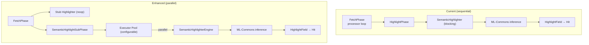

# Semantic Highlighter: Parallel Processing Enhancement

## 1  Current behaviour

* The OpenSearch fetch phase runs the built-in `HighlightPhase`.
* For every search hit (and every highlighted field) it calls `Highlighter.highlight(FieldHighlightContext)` **synchronously**.
* `SemanticHighlighter` (in neural-search) performs an ML-Commons inference inside this method, blocking the fetch thread.
* Result: one inference → one hit → one blocking call ⇒ sequential throughput on each shard.

```
for (SearchHit hit : hits) {
    HighlightField f = semanticHighlighter.highlight(ctx); // blocks
}
```

## 2  Problem statement

When a query returns _N_ hits the shard's fetch thread issues _N_ consecutive
ML inference requests. Latency grows linearly, throughput is capped by a
single thread.

Batching the requests in a single inference call would solve the issue but
requires model + ML-Commons changes that the team does **not** want right now.
Instead we aim to **run the per-hit calls in parallel**.

## 3  Design overview (no core changes)



1. **Stub highlighter**
   * Still registered under the name `semantic` so user requests parse.
   * `highlight()` quickly captures relevant data and/or returns `null`.
2. **`SemanticHighlightSubPhase`** (new class)
   * Implements `FetchSubPhase` and is registered from the plugin.
   * Collects every `HitContext` that has a `semantic` highlight request.
   * In its `process()` callback it immediately submits one task **per hit** to
     the OpenSearch `generic` thread-pool (bounded by a semaphore for back-pressure).
   * Each task invokes `SemanticHighlighterEngine.getHighlightedSentences(...)` synchronously and
     then updates the hit's highlight map.
   * A shared list of `Future<?>` objects is tracked; the processor waits for all of them before returning from the last `process()` call.

## 4  Implementation steps (low-level)

1. **Configuration setting (dynamic)**
   * Add a **cluster setting** `plugins.neural_search.semantic_highlighting.max_parallelism` *(type: integer, scope: node, dynamic)*.
   * Default value: `Math.min(Runtime.getRuntime().availableProcessors(), 8)`.
   * Setting can be updated at runtime via `PUT _cluster/settings` to tune for hardware or workload.
   * Expose getter helper `settingsAccessor.getSemanticHighlightParallelism()` inside the plugin.

2. **Add executor**
   ```java
   int poolSize = settingsAccessor.getSemanticHighlightParallelism();
   ExecutorService pool = EsExecutors.daemonThreadPool("semantic-hl", poolSize);
   ```
3. **Create `SemanticHighlightSubPhase`**
   ```java
   public class SemanticHighlightSubPhase implements FetchSubPhase {
       @Override
       public FetchSubPhaseProcessor getProcessor(FetchContext fc) {
           return fc.highlight()==null ? null : new Processor(fc);
       }
       static class Processor implements FetchSubPhaseProcessor {
           private final List<Future<?>> futures = new ArrayList<>();
           private final Semaphore permits = new Semaphore(poolSize * 3);

           public void process(HitContext hc) {
               try {
                   permits.acquire();
                   futures.add(pool.submit(() -> {
                       try { highlightOne(hc); }
                       finally { permits.release(); }
                   }));
               } catch (InterruptedException ie) {
                   Thread.currentThread().interrupt();
               }
           }
       }
   }
   ```
4. **Register sub-phase** in `NeuralSearch.getFetchSubPhases()`.
5. **Convert existing `SemanticHighlighter` to stub** (return `null` immediately).
6. **Thread-safety & limits**
   * The semaphore above implements **back-pressure**: when hits ≫ threads, submission blocks and fetch latency degrades gracefully instead of OOMing.
   * Consider a timeout (e.g. 5 s) on `Future#get()`